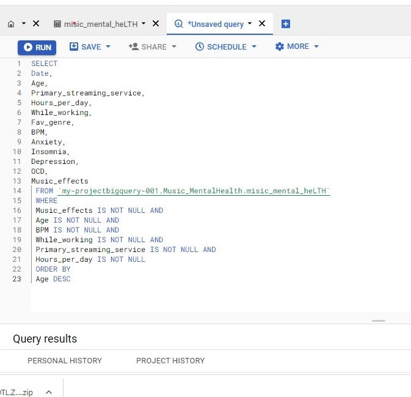
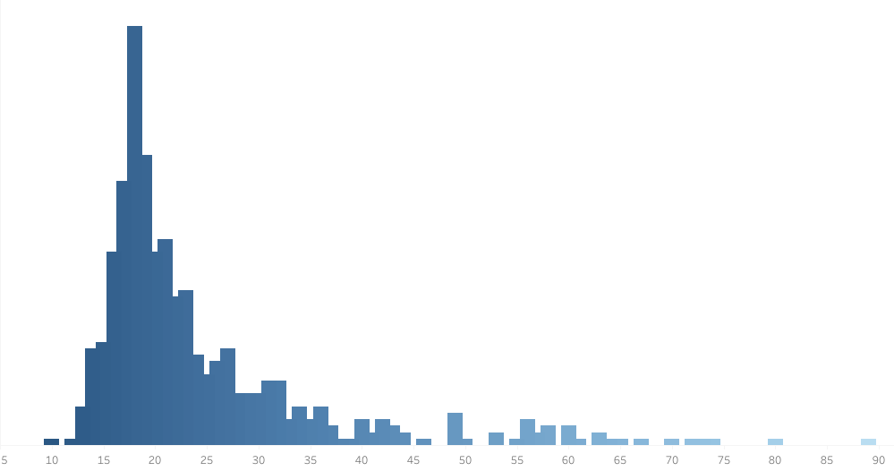
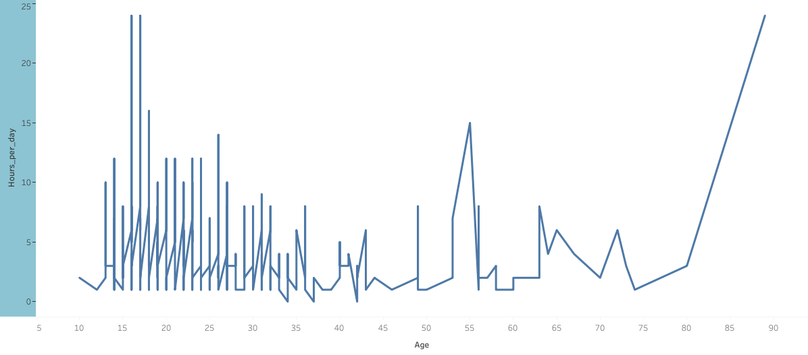

# Music and Mental Health Project

## Introduction
This document provides an overview of the data analysis process used for the music and mental health project. It outlines the project objectives, the data used, the data sources, the data cleaning process, and the methodology employed to analyze the data.

## Project Objectives
The objective of this data analysis is to answer the following questions:
- What age groups responded to the survey?
- What are the most popular streaming services used from the survey?

- What is the effect of music on mental health?
- How long do they listen to music?

## Data Sources
The dataset used in this project was collected from Kaggle. The dataset was a survey Managed, collected, and uploaded by Catherinerasgaitis. This data contains information about how people listen to music, their health condition i.e., insomnia, depression, OCD, and BMP, the genre they listen to, how they stream their music, and how music affects their mental health.

## Methods
The data analysis was conducted using SQL queries and Tableau for visualization. The queries used to answer the objectives were designed to filter out missing and erroneous data and transform data types.

### Process in Cleaning the Data
- Using SQL to pull the needed column
"This is the query used to fetch the needed data from the dataset". The result was then downloaded and exported into an excel sheet.

- Removing duplicates

This was done to ensure that data integrity is maintained and that the results from the analysis are accurate and precise. The image above shows there are no duplicates.

- Removing Blank Cells: This is also done to ensure data integrity is maintained and remove all forms 
of data inconsistency in data to avoid deriving irrelevant/useless insights.

We can see from here that after creating a filter to check for the rows which are empty in the age
column, there are no blank cells. Therefore, this is where we end the cleaning process.

## Analysis
The data was analyzed using Tableau to create an interactive visualization and dashboard

### Analysis and Visualization
- Firstly, we want to know the age of the respondents 
 This visual shows that most of the respondents are between the age of 15-21.
- Also, we want to check which streaming servicce do the respondents use more
 The least popular streaming service is pandora while the most popular is Spotify. Unlike apple 
music, Spotify is a free streaming service. majority of the respondents are in their teens therefore they 
might not be able to pay for a streaming service which make Spotify a good choice for them.
- Next, we want to know how the respondents listen to music i.e the hours they spend listening to music
 The above viz shows how respondents of different age listen to music everyday. Just three people listen to music for 24 hours and they are 16, 17, and 89.

## Result
.png)
The results of the analysis showed that music have a significant positive impact on human mental 
health and wellbeing. This might not be 100% accurate as some of the respondents might not have answered the survey question sincerely. The dashboard can be explored using the link below;
 https://public.tableau.com/views/mental_health_16741601522030/Dashboard1?:language=en-US&:display_count=n&:origin=viz_share_link

## Conclusion and Suggestion
This document provides an overview of the data analysis process used for the music and mental health 
project. The data was cleaned and analyzed using SQL and Excel for further cleaning, and the results 
showed that music had a significant positive impact on human mental health and wellbeing. The result 
indicated that music therapy works and I will advise everyone to incorporate the habit of listening to 
music.

